# The Design Principle of Blockchain

By Sunshine, Primitive Lane, Metaverse

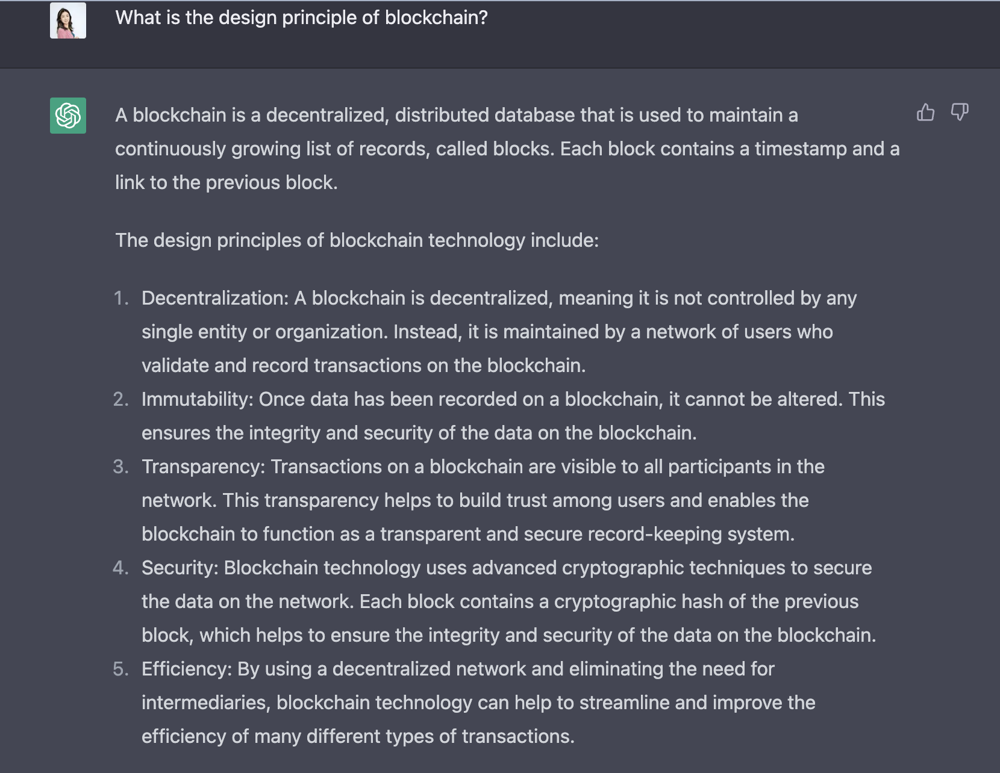

#### Figure: A conversation between Sunshine and Chat GPT-3 on 2022/12/30

*Disclaimer: Primitives Lane is a non-profit research group focused on blockchain and other frontier technologies. We are dedicated
to solving the most fundamental public issues in frontier fields, helping researchers grow steadily, and creating a friendly
and supportive space for builders.* 

*Acknowledgments: TBA*

## Part I:  Blockchain Related SoKs

### 1.1. Worldcloud

#### 1.1.1. Title

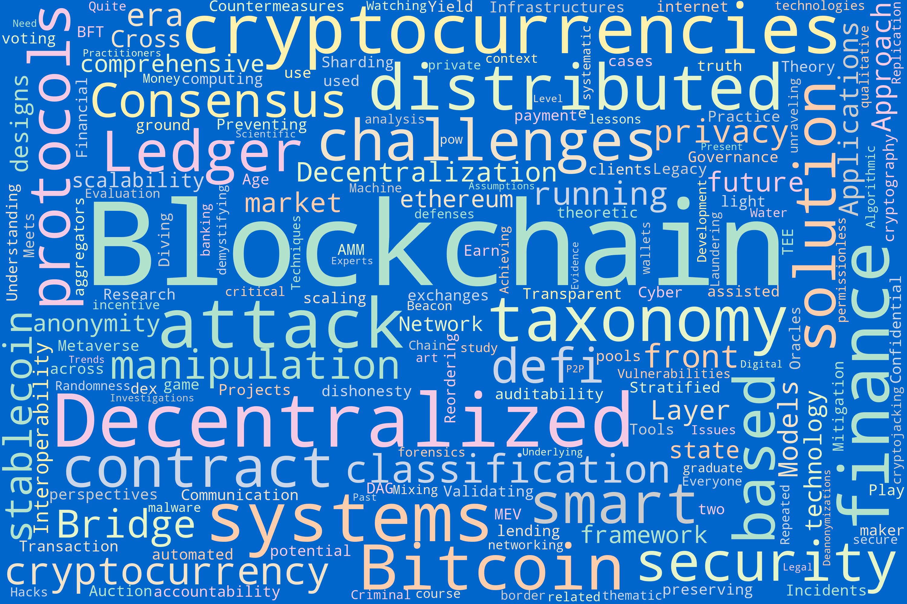

#### 1.1.2. Abstract
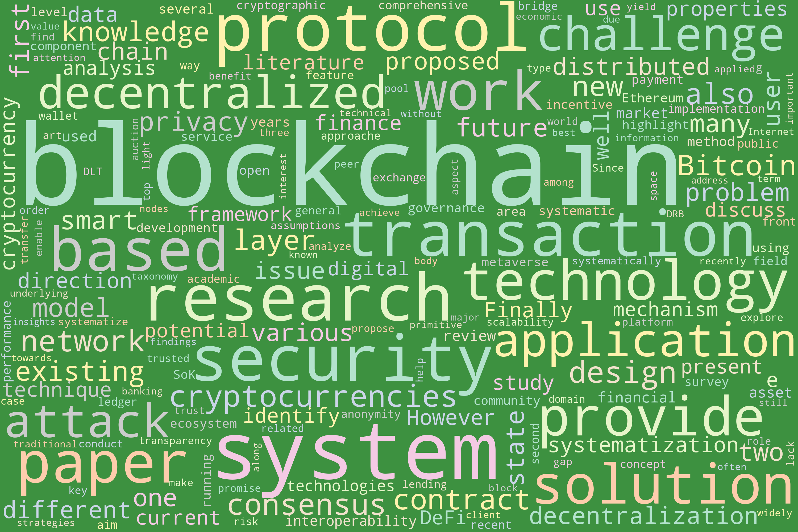

### 1.2. Bigram

#### 1.2.1. Title
- [Click Here to See the Interactive Figure](https://sunshineluyao.github.io/design-principle-blockchain/figs/SoKs/title_bigram.html)
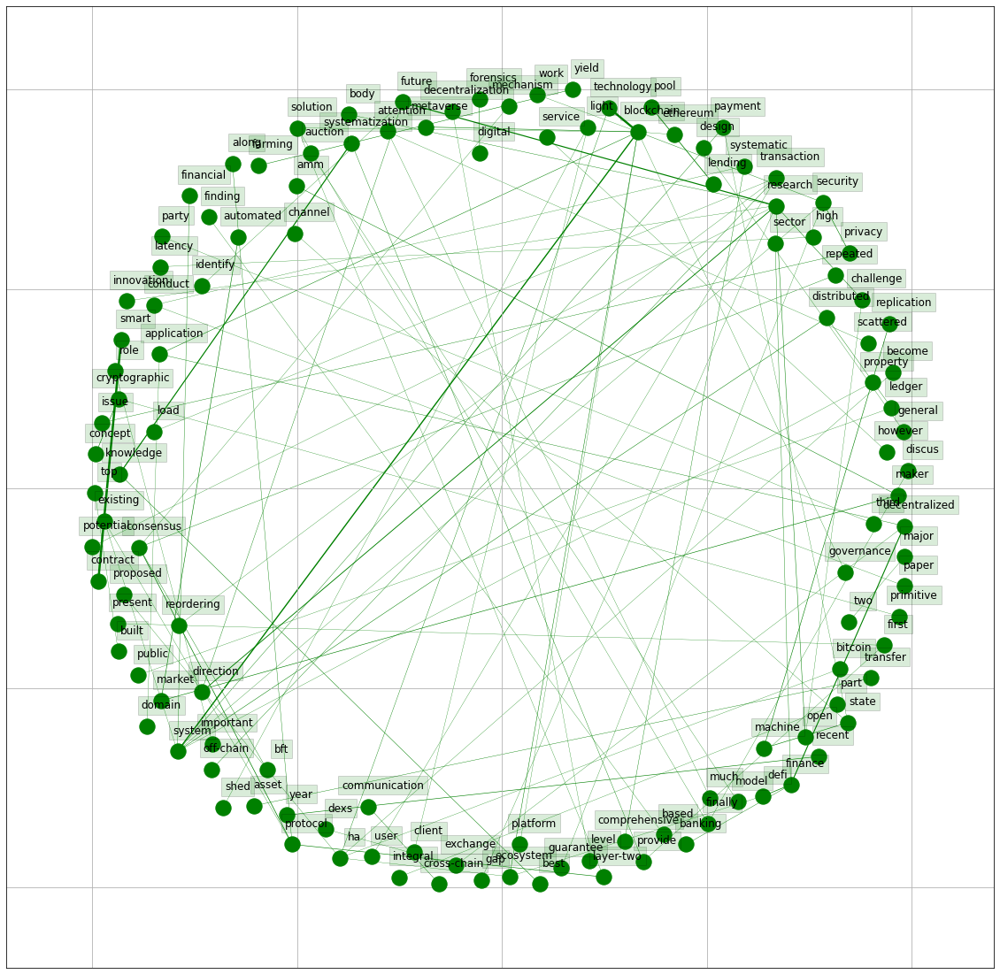

#### 1.2.2. Abstract
- [Click Here to See the Interactive Figure](https://sunshineluyao.github.io/design-principle-blockchain/figs/SoKs/abstract_bigram.html)
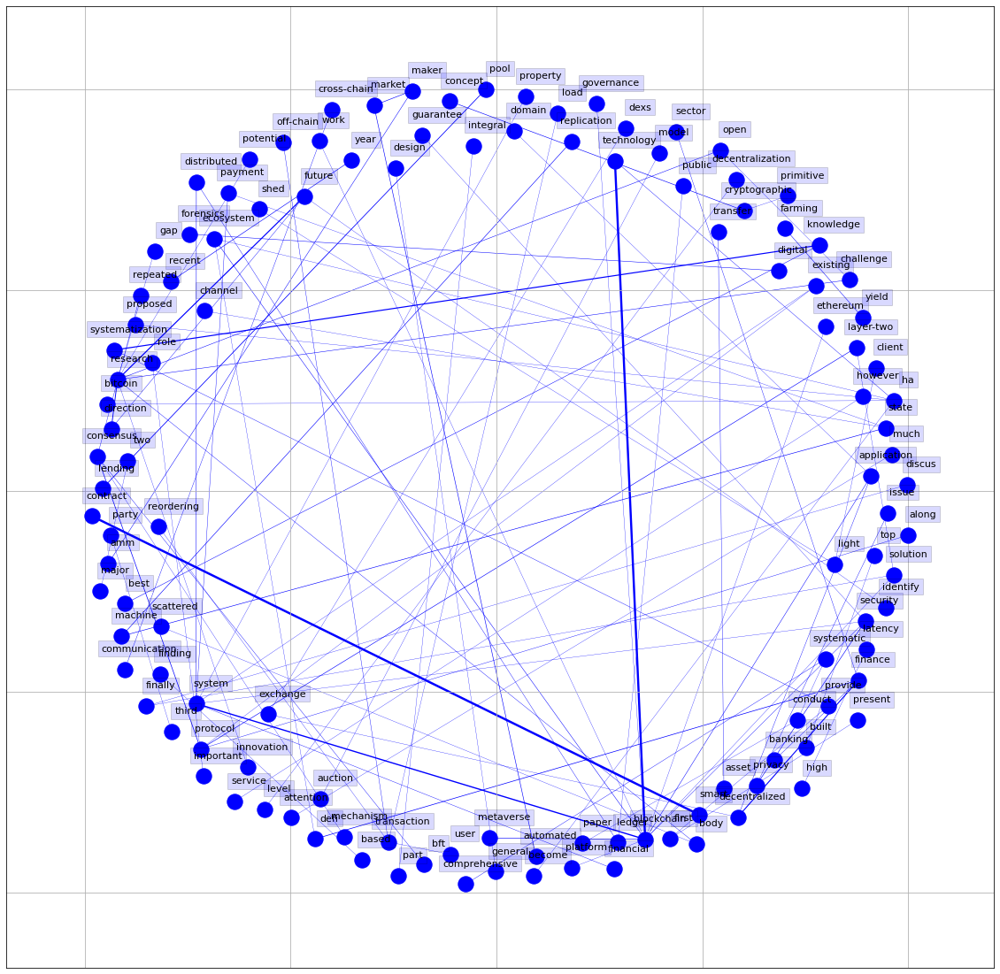

###  1.3. Reference List
#### 1.3.1. Category 1 Security and Privacy

|Citation                       | Title                                                  | URL                                          | 
|-------------------------------|--------------------------------------------------------|----------------------------------------------|
|Almashaqbeh and Solomon [2022] |SoK: privacy-preserving computing in the blockchain era |https://ieeexplore.ieee.org/document/9797340  |
|Bonneau et al. [2015]          |SoK: Research Perspectives and Challenges for Bitcoin and Cryptocurrencies|https://ieeexplore.ieee.org/document/7163021|
|Wang [2021] |SoK: Understanding BFT Consensus in the Age of Blockchains|https://eprint.iacr.org/2021/911|
| Eskandari et al. [2020]     | Sok: Transparent dishonesty: front-running attacks on blockchain                                    |https://link.springer.com/chapter/10.1007/978-3-030-43725-1_13 |
| Baum et al. [2021]          | Sok: Mitigation of front-running in decentralized finance                                           |https://eprint.iacr.org/2021/1628 |
|Raikwar et al. [2019]       | SoK of used cryptography in blockchain                                                              |https://ieeexplore.ieee.org/document/8865045 |
| Heimbach and Wattenhofer [2022]      | SoK: Preventing Transaction Reordering Manipulations in Decentralized Finance                       |https://arxiv.org/abs/2203.11520|
|Zhou et al. [2022]       | SoK: Decentralized Finance (DeFi) Incidents                                                         | https://arxiv.org/abs/2208.13035|
|Li et al. [2022]          | SoK: TEE-assisted Confidential Smart Contract                                                       |https://arxiv.org/abs/2203.08548 |
|Ankele et al. [2020]        | SoK: Cyber-Attack Taxonomy of Distributed Ledger-and Legacy Systems-based Financial Infrastructures |https://www.joanneum.at/en/digital/publications/details/sok-cyber-attack-taxonomy-of-distributed-ledger-and-legacy-systems-based-financial-infrastructures |
|Yang et al. [2022]          | SoK: MEV Countermeasures: Theory and Practice                                                       |https://arxiv.org/abs/2212.05111  |
|Azouvi and Hicks [2019]        | Sok: Tools for game theoretic models of security for cryptocurrencies                               |https://arxiv.org/abs/1905.08595 |
|Atzei et al. [2017]      | A survey of attacks on ethereum smart contracts (sok)                                               | https://dl.acm.org/doi/10.1007/978-3-662-54455-6_8|
|Judmayer et al. [2021]      | Sok: Algorithmic incentive manipulation attacks on permissionless pow cryptocurrencies              |https://link.springer.com/chapter/10.1007/978-3-662-63958-0_38 |
| Di Angelo et al. [2020]            | SoK: Development of secure smart contracts--lessons from a graduate course                          |https://link.springer.com/chapter/10.1007/978-3-030-43725-1_8 |
| Chen et al. [2020]      | A survey on ethereum systems security: Vulnerabilities, attacks, and defenses                       |https://dl.acm.org/doi/fullHtml/10.1145/3391195 |
| Islam et al. [2021]     | A Review on Blockchain Security Issues and Challenges                                               |https://ieeexplore.ieee.org/document/9515276 |
|Li et al. [2020]      | A survey on the security of blockchain systems                                                      |https://www.sciencedirect.com/science/article/abs/pii/S0167739X17318332 |
| Garay and Kiayias [2020]     | Sok: A consensus taxonomy in the blockchain era                                                     |https://eprint.iacr.org/2018/754 |
| Tekiner et al. [2021]      | SoK: cryptojacking malware                                                                          |https://arxiv.org/abs/2103.03851 |
|Alsalami and Zhang [2019]     | SoK: A systematic study of anonymity in cryptocurrencies                                            |https://ieeexplore.ieee.org/document/8937681 |
| Deuber et al. [2022]       | SoK: Assumptions Underlying Cryptocurrency Deanonymizations                                         |https://eprint.iacr.org/2022/763 |
| Rinberg and Agarwal [2022]   | Privacy when Everyone is Watching: An SOK on Anonymity on the Blockchain                            | https://eprint.iacr.org/2022/985|
| Bonomi et al. [2021]      | SoK: Achieving State Machine Replication in Blockchains based on Repeated Consensus                 |https://arxiv.org/abs/2105.13732 |
| Ghesmati et al. [2021]      | SoK: How private is Bitcoin? Classification and Evaluation of Bitcoin Mixing Techniques             |https://eprint.iacr.org/2021/629 |
|Franzoni and Daza [2022]   | SoK: Network-Level Attacks on the Bitcoin P2P Network                                               |https://dl.acm.org/doi/abs/10.1145/3538969.3538971 |

#### 1.3.2. Category 2 Scalability

|Citation                       | Title                                                  | URL                                          | 
|-------------------------------|--------------------------------------------------------|----------------------------------------------|
| Wang et al. [2019]        | SoK: Sharding on Blockchain                                                                         |https://dl.acm.org/doi/10.1145/3318041.3355457 |
| Gudgeon et al. [2020]     | SoK: Layer-Two Blockchain Protocols                                                                 |https://link.springer.com/chapter/10.1007/978-3-030-51280-4_12 |
| McCorry et al. [2021]   | Sok: Validating bridges as a scaling solution for blockchains                                       |https://link.springer.com/chapter/10.1007/978-3-030-51280-4_12 |
| Chatzigiannis et al. [2022] | Sok: Blockchain light clients                                                                       |https://dl.acm.org/doi/abs/10.1007/978-3-031-18283-9_31 |
| Zhou et al. [2020]   | Solutions to scalability of blockchain: A survey                                                    |https://ieeexplore.ieee.org/document/8962150 |

#### 1.3.3. Category 3 Decentralization

|Citation                       | Title                                                  | URL                                          | 
|-------------------------------|--------------------------------------------------------|----------------------------------------------|
| Zhang et al. [2022]       | SoK: Blockchain Decentralization                                                                     |https://arxiv.org/abs/2205.04256 |
| Karakostas et al. [2022]   | SoK: A Stratified Approach to Blockchain Decentralization                                           |https://arxiv.org/abs/2211.01291 |
| Raikwar and Gligoroski [2022]    | SoK: Decentralized Randomness Beacon Protocols  | https://arxiv.org/abs/2205.13333|

#### 1.3.4. Category 4 Applicability
| Citation                        | Title                        | URL  |
|---------------------------------|-----------------------------|-----------------------------------------|
| Gudgeon et al. [2020]         | SoK: Layer-Two Blockchain Protocols                                               |https://link.springer.com/chapter/10.1007/978-3-030-51280-4_12 |
| Bartoletti et al. [2021]      | SoK: lending pools in decentralized finance                                       |https://link.springer.com/chapter/10.1007/978-3-662-63958-0_40 |
| Werner et al. [2021]          | SoK: Decentralized Finance (DeFi)                                                 |https://arxiv.org/abs/2101.08778 |
| Xu et al. [2021]              | SoK: Decentralized Exchanges (DEX) with Automated Market Maker (AMM) Protocols    |https://arxiv.org/abs/2103.12732 |
| Shi et al. [2021]      | When Blockchain Meets Auction Models: A Survey, Some Applications, and Challenges |  https://arxiv.org/abs/2110.12534      |
| Abuidris et al. [2019]      | A survey of blockchain-based on e-voting systems                                  |https://dl.acm.org/doi/abs/10.1145/3376044.3376060  |
| Gadekallu et al. [2022]  | Blockchain for the Metaverse: A Review                                            | https://arxiv.org/abs/2203.09738    |
| Ali et al. [2019]       | Blockchain and the future of the internet: A comprehensive review                 |https://arxiv.org/abs/1904.00733      |
| Cousaert et al. [2022]      | Sok: Yield aggregators in defi                                                    | https://arxiv.org/abs/2105.13891|
| Yu et al. [2022]   | SoK: Play-to-Earn Projects                       |https://arxiv.org/abs/2211.01000 |
| Dotan et al. [2020]  | SoK: cryptocurrency networking context, state-of-the-art, challenges     |https://dl.acm.org/doi/10.1145/3407023.3407043      |
| Moin et al. [2020]   | SoK: A classification framework for stablecoin designs  | https://link.springer.com/chapter/10.1007/978-3-030-51280-4_11     |
| Gan et al. [2021]   | A critical review of blockchain applications to banking and finance: a qualitative thematic analysis approach |https://www.tandfonline.com/doi/abs/10.1080/09537325.2021.1979509?journalCode=ctas20 |
| Dasaklis et al. [2021]    | Sok: Blockchain solutions for forensics                                           |https://link.springer.com/chapter/10.1007/978-3-030-69460-9_2        |
| Wang [2021]      | SoK: tokenization on blockchain                                      | https://eprint.iacr.org/2021/1536|
|Karantias [2020]   | Sok: A taxonomy of cryptocurrency wallets                         |https://eprint.iacr.org/2020/868 |
| Clark et al. [2019]  | SoK: demystifying stablecoins                                  |https://papers.ssrn.com/sol3/papers.cfm?abstract_id=3466371       |
| Jourenko et al. [2019]      | SoK: A taxonomy for layer-2 scalability related protocols for cryptocurrencies    |https://eprint.iacr.org/2019/352    |
| Lande and Zunino [2018]         | SoK: unraveling Bitcoin smart contracts                                           |https://iris.unica.it/handle/11584/251263 |
| Moin et al. [2020]     | SoK: A Classification Framework for Stablecoin Designs                            |https://link.springer.com/chapter/10.1007/978-3-030-51280-4_11      |

#### 1.3.5.  Category 5 Governance and Regulation
|Citation                       | Title                                                  | URL                                          | 
|-------------------------------|--------------------------------------------------------|----------------------------------------------|
| Kiayias and Lazos [2022]        | SoK: Blockchain Governance           | https://arxiv.org/abs/2201.07188               |
|Chatzigiannis et al. [2021]   | SoK: Auditability and Accountability in Distributed Payment Systems               | https://link.springer.com/chapter/10.1007/978-3-030-78375-4_13               |
| Kolachala et al. [2021]      | SoK: Money Laundering in Cryptocurrencies     |  https://dl.acm.org/doi/abs/10.1145/3465481.3465774              |
|Casino et al. [2022]      | SoK: Cross-border Criminal Investigations and Digital Evidence                    |https://arxiv.org/abs/2205.12911 |
| Deuber et al. [2022]        | SoK: Assumptions Underlying Cryptocurrency Deanonymizations--A Taxonomy for Scientific Experts and Legal Practitioners               | https://eprint.iacr.org/2022/763               |

#### 1.3.6. Category 6 Blockchain System Design
|Citation                       | Title                                                  | URL                                          | 
|-------------------------------|--------------------------------------------------------|----------------------------------------------|
|Wang et al. [2020]      | SoK: Diving into DAG-based blockchain systems                  |https://arxiv.org/abs/2012.06128  |
| Bellaj et al. [2022]      | SoK: a comprehensive survey on distributed ledger technologies |https://hal.archives-ouvertes.fr/hal-03609651/  |

#### 1.3.7. Category 7 Cross-Chain and Interoperability
|Citation                       | Title                                                  | URL                                          | 
|-------------------------------|--------------------------------------------------------|----------------------------------------------|
| Zamyatin et al. [2021]    | Sok: Communication across distributed ledgers  |https://link.springer.com/chapter/10.1007/978-3-662-64331-0_1  |         
| Wang [2021]         | Sok: Exploring blockchains interoperability             |https://eprint.iacr.org/2021/537  |
| Eskandari et al. [2021]     | Sok: Oracles from the ground truth to market manipulation   |https://dl.acm.org/doi/abs/10.1145/3479722.3480994  |
| Lee et al. [2022]      | SoK: Not Quite Water Under the Bridge: Review of Cross-Chain Bridge Hacks  |https://arxiv.org/abs/2210.16209  |
|  Belchior et al. [2021]       |  A Survey on Blockchain Interoperability: Past, Present, and Future Trends | https://dl.acm.org/doi/10.1145/3471140 |
| Belchior et al. [2022]    | Do You Need a Distributed Ledger Technology Interoperability Solution?|https://dl.acm.org/doi/10.1145/3564532|

## Part II: White papers for top blockchain projects and/or cross-chain solutions
### 1.1. Wordcloud
#### 1.1.1. Title

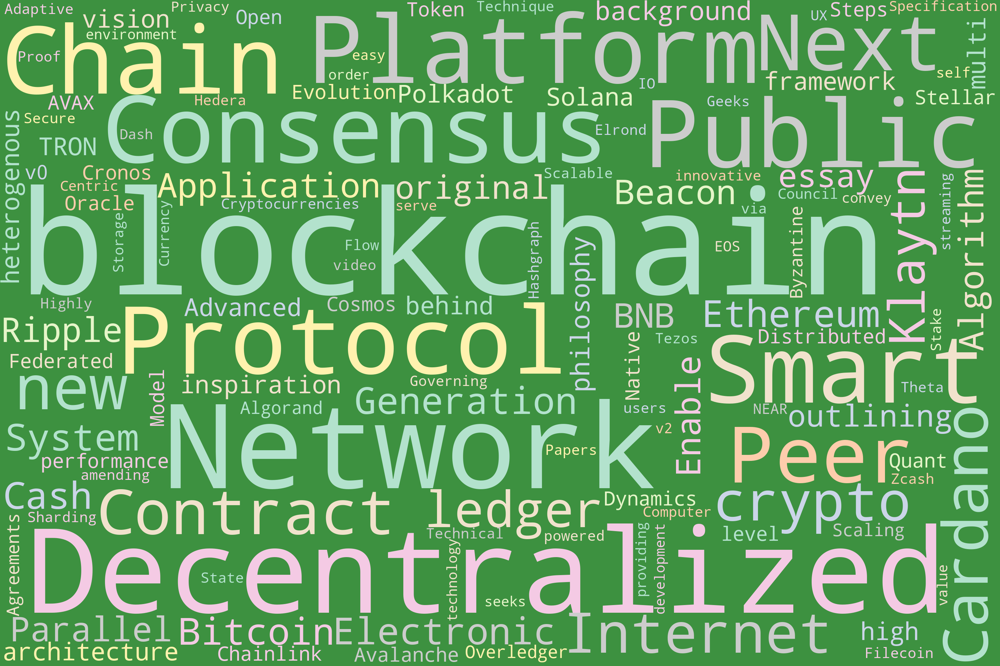

#### 1.1.2. Abstract
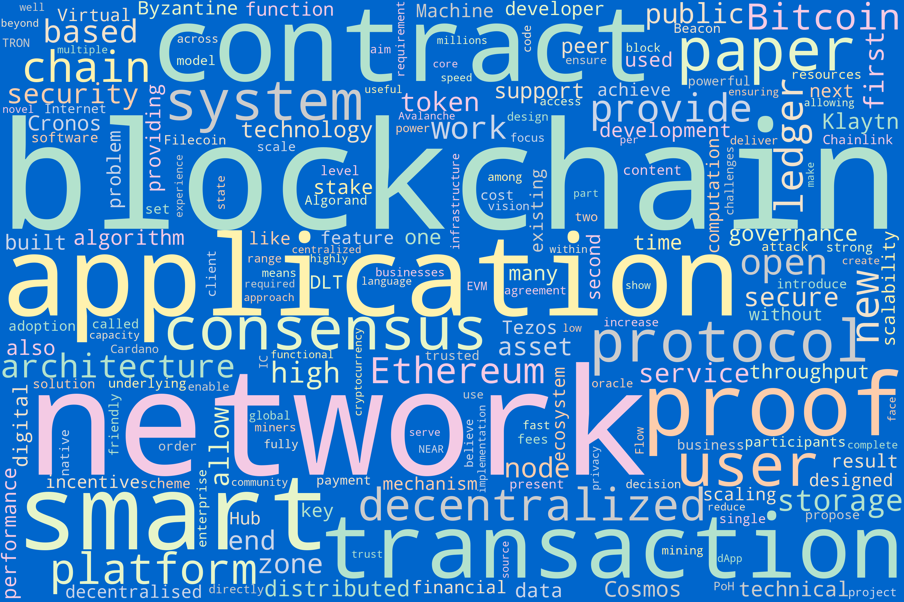

### 1.2. Bigram
#### 1.2.1. Title
- [Click Here to See the Interactive Figure](https://sunshineluyao.github.io/design-principle-blockchain/figs/whitepapers/whitepaper_title_bigram.html)
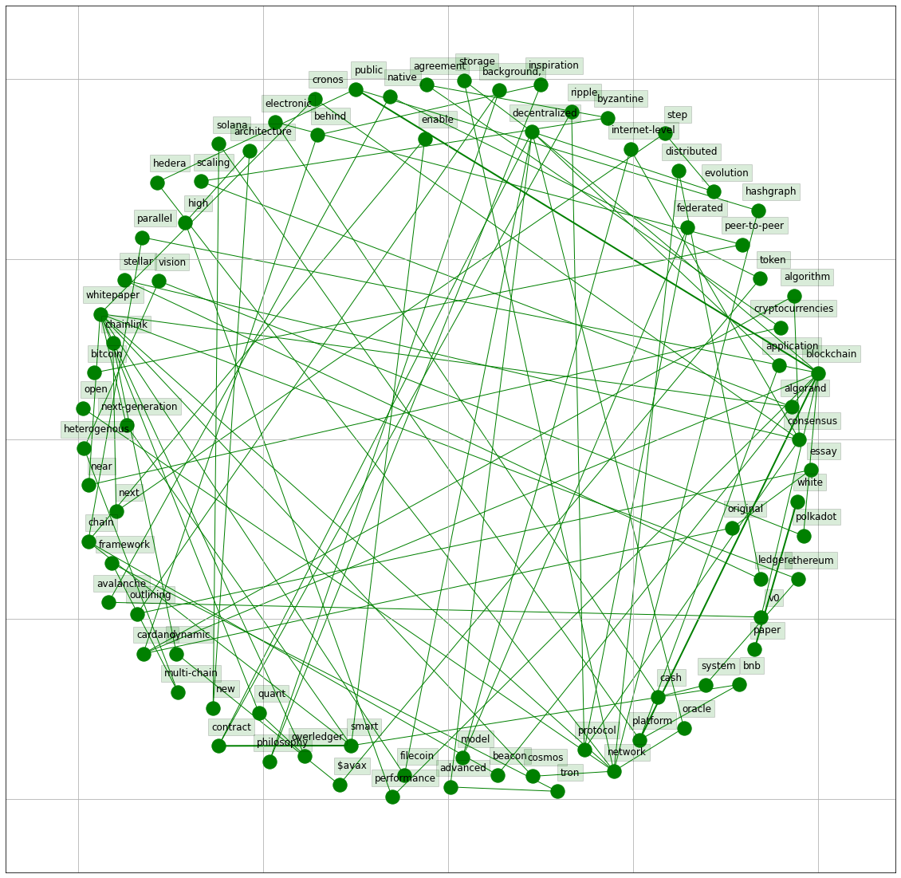

### 1.2.2. Abstract
- [Click Here to See the Interactive Figure](https://sunshineluyao.github.io/design-principle-blockchain/figs/whitepapers/whitepaper_abstract_bigram.html)
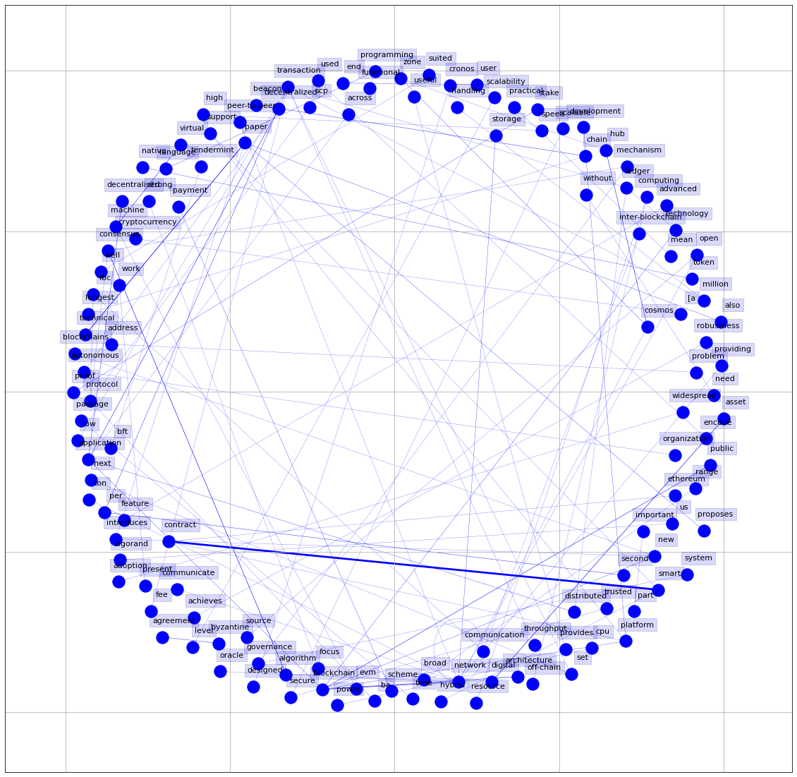

### 1.3. Reference List

*The blockchain projects and/or cross-chain solutions ranked by market values retrived from [https://coinmarketcap.com/](https://coinmarketcap.com/) on 2022/12/27* (dApps are excluded)

|   Rank  | name                   | symbol   |   Genesis | Type        | Coinmarketcap                                           | whitepaper                                                                                                                   |
|--------:|:-----------------------|:---------|----------:|:------------|:--------------------------------------------------------|:-----------------------------------------------------------------------------------------------------------------------------|
|       1 | Bitcoin                | BTC      |      2009 | Blockchain  | https://coinmarketcap.com/currencies/bitcoin/           | https://bitcoin.org/bitcoin.pdf                                                                                              |
|       2 | Ethereum               | ETH      |      2015 | Blockchain  | https://coinmarketcap.com/currencies/ethereum/          | https://ethereum.org/en/whitepaper/                                                                                          |
|       3 | Binance smart chain    | BNB      |      2017 | Blockchain  | https://coinmarketcap.com/currencies/bnb/               | https://github.com/binance-chain/whitepaper/blob/master/WHITEPAPER.md                                                        |
|       4 | XRP Ledger (Ripple)    | XRP      |      2021 | Blockchain  | https://coinmarketcap.com/currencies/xrp/               | https://ripple.com/files/ripple_consensus_whitepaper.pdf                                                                     |
|       5 | Cardano                | ADA      |      2017 | Blockchain  | https://coinmarketcap.com/currencies/cardano/           | https://docs.cardano.org/en/latest/                                                                                          |
|       6 | Polkadot               | DOT      |      2022 | Cross-chain | https://coinmarketcap.com/currencies/polkadot-new/      | https://polkadot.network/PolkaDotPaper.pdf                                                                                   |
|       7 | TRON                   | TRX      |      2017 | Blockchain  | https://coinmarketcap.com/currencies/tron/              | https://tron.network/static/doc/white_paper_v_2_0.pdf                                                                        |
|       8 | Solana                 | SOL      |      2020 | Blockchain  | https://coinmarketcap.com/currencies/solana/            | https://solana.com/solana-whitepaper.pdf                                                                                     |
|       9 | Avalanche              | AVAX     |      2020 | Blockchain  | https://coinmarketcap.com/currencies/avalanche/         | https://assets.website-files.com/5d80307810123f5ffbb34d6e/6008d7bc56430d6b8792b8d1_Avalanche%20Native%20Token%20Dynamics.pdf |
|      10 | Chainlink              | LINK     |      2017 | Cross-chain | https://coinmarketcap.com/currencies/chainlink/         | https://chain.link/whitepaper                                                                                                |
|      11 | The Open Network (TON) | TON      |      2018 | Blockchain  | https://coinmarketcap.com/currencies/toncoin/           | https://tron.network/static/doc/white_paper_v_2_0.pdf                                                                        |
|      12 | Cosmos                 | ATOM     |      2016 | Cross-chain | https://coinmarketcap.com/currencies/cosmos/            | https://v1.cosmos.network/resources/whitepaper                                                                               |
|      13 | Stellar                | XLM      |      2015 | Blockchain  | https://coinmarketcap.com/currencies/stellar/           | https://www.stellar.org/papers/stellar-consensus-protocol.pdf                                                                |
|      14 | Cronos Chain           | CRO      |      2018 | Blockchain  | https://coinmarketcap.com/currencies/cronos/            | https://whitepaper.cronos.org/                                                                                               |
|      15 | Quant Overledger       | QNT      |      2018 | Cross-chain | https://coinmarketcap.com/currencies/quant/             | https://whitepaper.io/coin/quant                                                                                             |
|      16 | Agorand                | ALGO     |      2019 | Blockchain  | https://coinmarketcap.com/currencies/algorand/          | https://www.algorand.com/technology/white-papers                                                                             |
|      17 | NEAR Protocol          | NEAR     |      2021 | Blockchain  | https://coinmarketcap.com/currencies/near-protocol/     | https://near.org/papers/the-official-near-white-paper/                                                                       |
|      18 | Filecoin               | FIL      |      2017 | Cross-chain | https://coinmarketcap.com/currencies/filecoin/          | https://whitepaper.io/coin/filecoin                                                                                          |
|      19 | Hedera                 | HBAR     |      2019 | Blockchain  | https://coinmarketcap.com/currencies/hedera/            | https://www.hedera.com/papers                                                                                                |
|      20 | Internet Computer      | ICP      |      2021 | Blockchain  | https://coinmarketcap.com/currencies/internet-computer/ | https://internetcomputer.org/whitepaper.pdf                                                                                  |
|      21 | EOS Network            | EOS      |      2018 | Blockchain  | https://coinmarketcap.com/currencies/eos/               | https://github.com/EOSIO/Documentation/blob/master/TechnicalWhitePaper.md                                                    |
|      22 | MultiversX (Elrond)    | EGLD     |      2020 | Blockchain  | https://coinmarketcap.com/currencies/elrond-egld/       | https://elrond.com/assets/files/elrond-whitepaper.pdf                                                                        |
|      23 | Flow                   | FLOW     |      2018 | Blockchain  | https://coinmarketcap.com/currencies/flow/              | https://www.onflow.org/technical-paper/                                                                                      |
|      24 | Theta Network          | THETA    |      2019 | Blockchain  | https://coinmarketcap.com/currencies/theta-network/     | https://s3.us-east-2.amazonaws.com/assets.thetatoken.org/Theta-white-paper-latest.pdf                                        |
|      25 | Tezos                  | XTZ      |      2018 | Blockchain  | https://coinmarketcap.com/currencies/tezos/             | https://tezos.com/whitepaper.pdf                                                                                             |
|      26 | Zcash                  | ZEC      |      2016 | Blockchain  | https://coinmarketcap.com/currencies/zcash/             | https://github.com/zcash/zips/blob/master/protocol/protocol.pdf                                                              |
|      27 | Klaytn                 | KLAY     |      2019 | Blockchain  | https://coinmarketcap.com/currencies/klaytn/            | https://whitepaper.io/coin/klaytn                                                                                            |
|      28 | Dash                   | DASH     |      2014 | Blockchain  | https://coinmarketcap.com/currencies/dash/              | https://whitepaper.io/coin/dash                                                                                              |

## Part III: Blockchain Standards 

### 3.1. Wordcloud
#### 3.1.1. Title
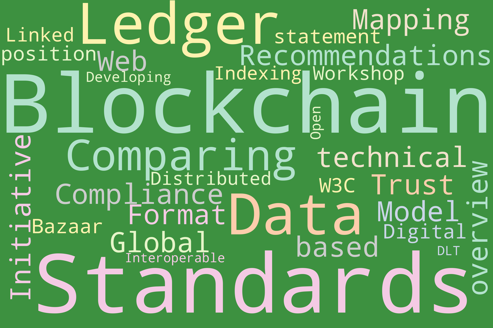
#### 3.1.2. Abstract
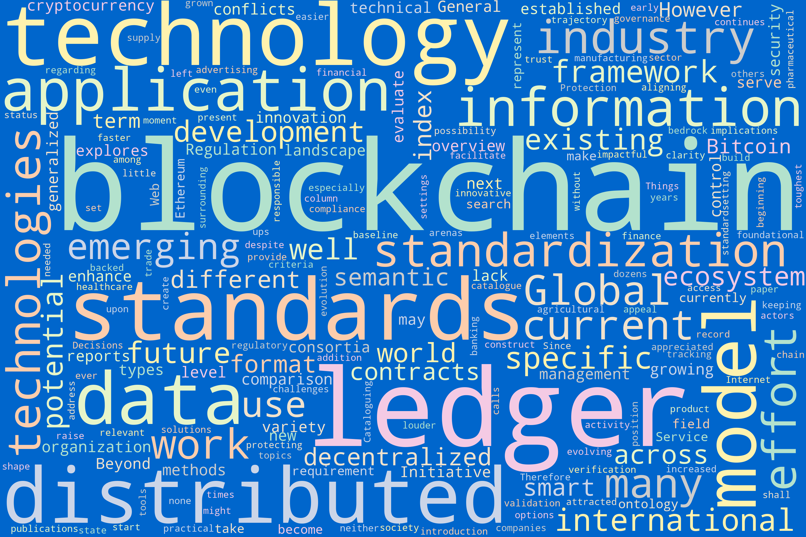

### 3.2. Bigram
#### 3.2.1. Title
- (Click Here to See the Interactive Figure)[https://sunshineluyao.github.io/design-principle-blockchain/figs/standards/standard_title_bigram.html]
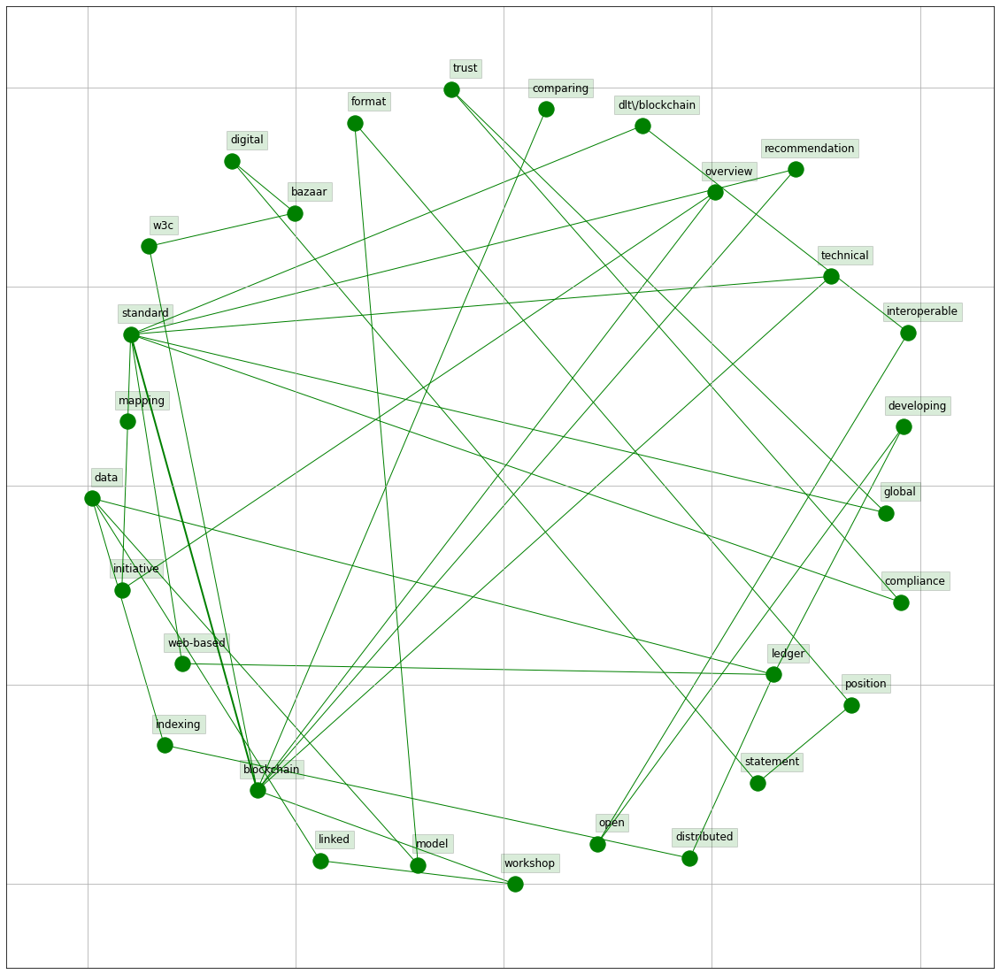
#### 3.2.2. Abstract
- [Click Here to See the Interactive Figure](https://sunshineluyao.github.io/design-principle-blockchain/figs/standards/standard_abstract_bigram.html)
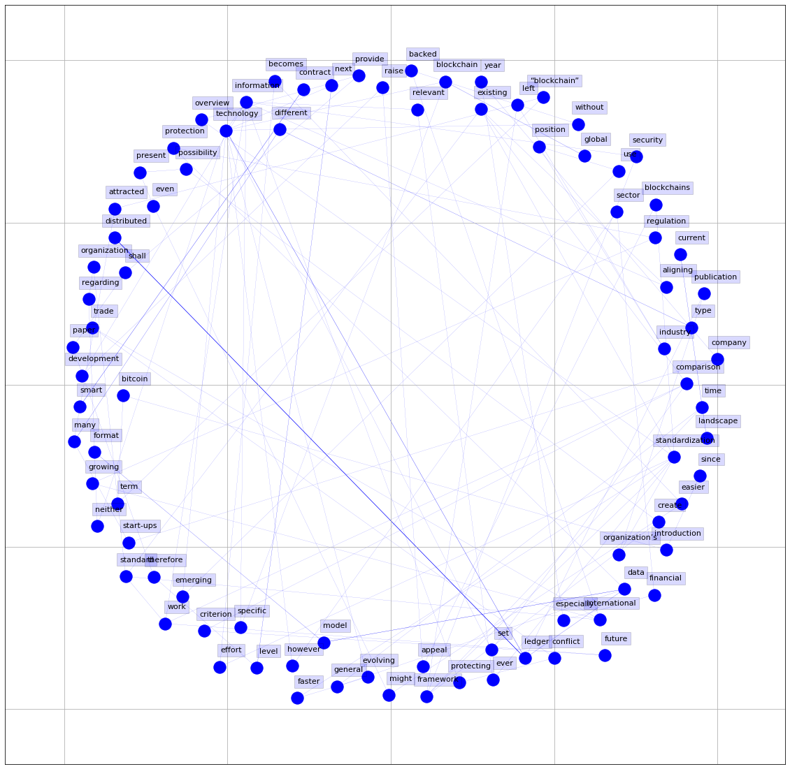

### 3.3. References

#### 3.3.1. Blokchain Standard Development References by Institution

| Institution                                                           | Blockchain Standard Development Reference               |
|:----------------------------------------------------------------------|:-------------------------------|
| The European Commission                                               | https://digital-strategy.ec.europa.eu/en/policies/blockchain-standards |
| IEEE                                                                  | https://blockchain.ieee.org/standards                     |
| The World Wide Web Consortium (W3C)                                   | https://www.w3.org/2016/04/blockchain-workshop/report.html                                                          |
| International Association for Trusted Blockchain Applications (Iatba) | https://inatba.org/standards-committee-working-group-lp/                                                            |
| National Institute of Standards and Technology (NIST)                 | https://nvlpubs.nist.gov/nistpubs/ir/2018/NIST.IR.8202.pdf                                                          |
| ANSI Accredited Standards Committee X9                                | https://x9.org/wp-content/uploads/2018/04/Distributed-Ledger-and-Blockchain-Technology-Study-Group-Report-FINAL.pdf |
| International Organization for Standardization (ISO)                  | https://www.iso.org/committee/6266604.html                                                                          |
| The European Union Agency for Cybersecurity (ENISA)                   | https://www.enisa.europa.eu/news/enisa-news/enisa-report-on-blockchain-technology-and-security                      |
| German Federal Office for Information Security (BSI)                  | https://www.bsigroup.com/globalassets/localfiles/en-gb/bsi_blockchain_dlt_web.pdf                                   |
| International Telecommunication Union (ITU)                           | https://www.itu.int/en/ITU-T/focusgroups/dlt/Pages/default.aspx                                                     |
| European Committee for Electrotechnical Standardization (CENELEC)     | https://www.cencenelec.eu/areas-of-work/cenelec-sectors/digital-society-cenelec/emerging-technologies/              |

#### 3.3.2. Blockchain Standard Papers
| Title                 | URL                                              |
|:----------------------|:-------------------------------------------------|
| Comparing Blockchain Standards and Recommendations | https://www.mdpi.com/1999-5903/12/12/222/pdf     |                                                                                                                                         
| Blockchain Standards for Compliance and Trust  |https://anjum.web.cern.ch/papers/d4sta.pdf                       |
| Global Standards  Mapping Initiative:  An overview of blockchain technical standards                             | https://www.weforum.org/whitepapers/global-standards-mapping-initiative-an-overview-of-blockchain-technical-standards |
| A Web-based Ledger Data Model and Format: A position statement by Digital Bazaar for the W3C Blockchain Workshop | https://www.w3.org/2016/04/blockchain-workshop/interest/sporny-longley.html                                           |
| Linked Data Indexing of Distributed Ledgers                                                                      | http://oro.open.ac.uk/49736/1/p1431.pdf                                                                               |
| Developing Open and Interoperable DLT\/Blockchain Standards                                                      | https://www.computer.org/csdl/magazine/co/2018/11/08625908/17D45XfSEUx                                                |

